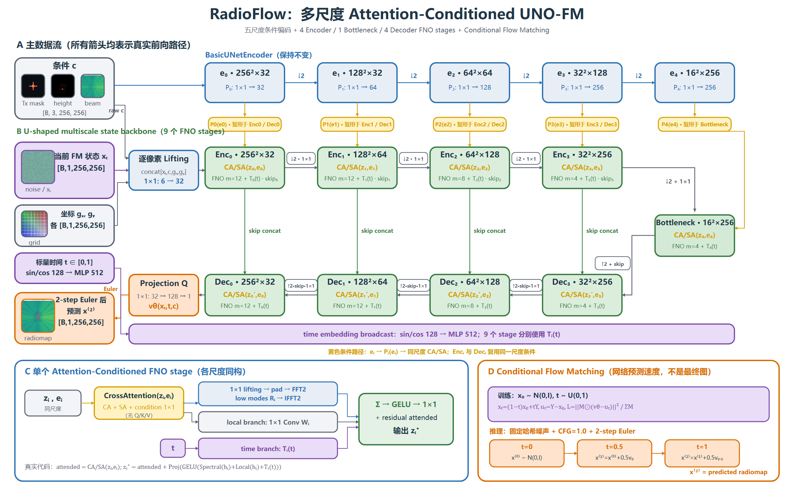

# RadioFlow Multiscale UNO-FM

这是 RadioFlow 的一个聚焦研究版本：使用 **Attention-Conditioned Multiscale UNO**
作为 Conditional Flow Matching（CFM）的速度网络，完成 6.7 GHz、0° 单波束无线电图预测。
当前发布覆盖 `8x8`、`16x16` 和 `32x32` 三种阵列，并锁定同一套
560/80/160 场景级 train/val/test 划分。

> 这是实验性扩展，不是原始 RadioFlow 论文代码的逐行复刻。蓝色条件编码器及
> CA/SA 融合沿用 RadioFlow 路径；状态速度骨干改为 U 形多尺度 FNO（UNO）。



## 发布范围

- 条件输入：`c = [Tx mask, height, beam map]`，形状 `[B,3,256,256]`。
- FM 状态：`x_t`，形状 `[B,1,256,256]`。
- 网络输出：速度场 `v_theta(x_t,t,c)`，形状 `[B,1,256,256]`，不是最终无线电图。
- 条件编码器：五尺度 `BasicUNetEncoder`。
- 状态骨干：4 个 encoder FNO stage、1 个 bottleneck stage、4 个 decoder FNO stage。
- 推理：EMA 权重、固定哈希噪声、CFG=1.0、2-step Euler。
- 训练：AdamW、AMP FP16、梯度累积、早停与严格 checkpoint 身份校验。

仓库不包含数据集、checkpoint、训练结果、缓存或测试目录。相关文件均被
`.gitignore` 排除。

## 环境

推荐 Python 3.10+ 和支持 CUDA 的 PyTorch。先按本机 CUDA 版本安装 PyTorch，
再安装其余依赖：

```bash
python -m venv .venv
source .venv/bin/activate
python -m pip install --upgrade pip
# 按 https://pytorch.org/get-started/locally/ 安装匹配 CUDA 的 torch
python -m pip install -r requirements.txt
```

## 数据准备

代码锁定的数据源与版本记录在 `experiments/provenance.py`，数据结构契约记录在
`experiments/multiconfig_schema.json`。数据根目录之外，还需要：

- `scene_split_seed42.json`：固定 560/80/160 场景划分；
- `height_stats_train.json`：仅由 560 个训练场景计算的高度归一化统计；
- 每个阵列一个 6.7 GHz、0°、800 条记录的 JSONL manifest。

例如生成 8x8 manifest：

```bash
python prepare_same_frequency.py build-manifest \
  --dataset-root /path/to/MultiConfigRadiomap \
  --split-path /path/to/manifests/scene_split_seed42.json \
  --array-size 8x8 \
  --frequency-hz 6700000000 \
  --steering-deg 0 \
  --output /path/to/manifests/manifest_samefreq_6.7ghz_8x8_0deg.jsonl
```

对 `16x16` 和 `32x32` 重复上述命令。三种阵列的 0° 波束 ID 不相同，代码会从
冻结 schema 中解析并校验，不能手工假设为同一个 beam ID。

## 训练与评估

先运行只读数据预检：

```bash
python run_same_frequency_multiscale_uno.py train \
  --dataset-root /path/to/MultiConfigRadiomap \
  --manifest-path /path/to/manifests/manifest_samefreq_6.7ghz_8x8_0deg.jsonl \
  --height-stats-path /path/to/manifests/height_stats_train.json \
  --run-root /path/to/runs/8x8 \
  --array-size 8x8 \
  --device cuda:0 \
  --resume none \
  --preflight-only
```

去掉 `--preflight-only` 即开始训练。中断后使用 `--resume auto` 从 `last.pt` 严格
续训。完整配置固定为最多 1000 轮、early-stopping patience 20、micro-batch 2、
梯度累积 28（effective batch 56）。

训练完成后先冻结验证集 CFG 选择，再且仅再运行一次测试集评估：

```bash
python run_same_frequency_multiscale_uno.py select-cfg \
  --dataset-root /path/to/MultiConfigRadiomap \
  --manifest-path /path/to/manifests/manifest_samefreq_6.7ghz_8x8_0deg.jsonl \
  --height-stats-path /path/to/manifests/height_stats_train.json \
  --run-root /path/to/runs/8x8 \
  --results-root /path/to/results/8x8 \
  --array-size 8x8 \
  --device cuda:0

python run_same_frequency_multiscale_uno.py test \
  --dataset-root /path/to/MultiConfigRadiomap \
  --manifest-path /path/to/manifests/manifest_samefreq_6.7ghz_8x8_0deg.jsonl \
  --height-stats-path /path/to/manifests/height_stats_train.json \
  --run-root /path/to/runs/8x8 \
  --results-root /path/to/results/8x8 \
  --array-size 8x8 \
  --device cuda:0
```

`results-root` 在正式测试前必须不存在；评估器用原子目录事务写入指标、逐样本预测
和可视化。三卡并行示例见 `scripts/run_three_arrays.sh`。

## Beam-zero 条件消融

为检验固定 beam map 是否成为压制建筑传播学习的条件捷径，消融分支保持
`[B,3,256,256]` 输入和全部模型参数不变，仅在归一化后将第三通道替换为零：

```text
Full:      [Tx mask, height, beam map]
Beam-zero: [Tx mask, height, zeros_like(beam map)]
```

单阵列命令在上述训练/评估命令中追加
`--condition-variant beam_zero`；三阵列并行入口为
`scripts/run_beam_zero_ablation.sh`。运行目录必须与 Full 完全分离。

建筑邻域比较在全部测试预测生成后运行：

```bash
python analyze_beam_ablation.py \
  --dataset-root /path/to/MultiConfigRadiomap \
  --manifest-dir /path/to/manifests \
  --full-results-root /path/to/full/results \
  --beam-zero-results-root /path/to/beam-zero/results \
  --output /path/to/beam-zero/results/region_comparison.json
```

假设、5 像素建筑邻域、0.25 dB 最小实际差异和停止规则已经在查看新结果前
冻结，详见下列研究文档。本地验证环境记录在 `environment-beam-zero.yml`。

## 文档

- [架构与数据流](docs/ARCHITECTURE.md)
- [复现实验](docs/REPRODUCE.md)
- [已完成结果](docs/RESULTS.md)
- [Beam map 条件捷径问题](docs/science-superpowers/questions/2026-09-05-beam-map-shortcut.md)
- [Beam-zero 消融分析计划](docs/science-superpowers/plans/2026-09-05-beam-map-shortcut.md)
- [冻结的 Beam-zero 预注册](docs/science-superpowers/preregistrations/2026-09-05-beam-map-shortcut.md)
- [发布整理说明](RELEASE_NOTES.md)

## 代码入口

```text
run_same_frequency_multiscale_uno.py   # train / select-cfg / test 统一入口
prepare_same_frequency.py              # 构造锁定 manifest
model/attention_multiscale_uno.py      # UNO-FM 主模型
model/fno.py                           # 2-D spectral convolution
training/                              # 配置、优化、EMA、checkpoint 与训练循环
evaluation/                            # 2-step Euler、指标与可视化
data_loaders/                          # 数据契约、归一化与 mask
```

## 结果摘要

固定协议下的单次服务器实验结果如下；详细口径见 [docs/RESULTS.md](docs/RESULTS.md)。

| Array | dB-RMSE ↓ | dB-MAE ↓ | NMSE ↓ | PSNR ↑ | SSIM ↑ |
|---|---:|---:|---:|---:|---:|
| 8x8 | 9.2108 | 5.5413 | 0.0026568 | 30.2565 | 0.9099 |
| 16x16 | 9.4604 | 5.6524 | 0.0029507 | 30.0243 | 0.9043 |
| 32x32 | 9.6818 | 5.8408 | 0.0034835 | 29.8233 | 0.8937 |

## License

沿用仓库根目录的 [LICENSE](LICENSE)。
