# RadioFlow 实验结果汇总：单波束 Lite 与 8×8 跨频率

> 数据源目录：`E:\RadioFlow\runs\`（训练过程）与 `E:\RadioFlow\results\`（测试评估与可视化）。
> 整理时间：2026-08-16。

## 0. 通用设置

所有实验均为条件流匹配（CFM）模型，条件 `c=[Tx_mask, Height, Beam_map]`（3 通道，256×256），
目标为归一化 dB 无线电图（有效 dB 区间 [-300, 0] → [0, 1]）。训练 `x0~N(0,I)`、`t~U(0,1)`、
速度目标 `u=x1-x0`，掩码 MSE；AdamW + EMA + 梯度累积；推理 2 步 Euler + CFG（固定哈希种子确定性噪声）。

共用超参：learning_rate 1e-3、weight_decay 1e-5、EMA decay 0.999、warmup 10%、
effective batch 56、AMP float16、seed 42、max_epochs 1000、early-stopping patience 20。

## 1. 6.7→6.7 单波束 Lite（8×8 / 16×16 / 32×32）

协议：6.7 GHz、0° 单波束、560/80/160 场景不相交划分（split_sha256 三者一致），模型 Lite。

### 1.1 训练过程

| 阵列 | 完成轮数 | 优化步 | 训练时长 | 最佳轮 | 最佳 val dB-RMSE | 最佳 val PSNR / SSIM |
|---|---|---|---|---|---|---|
| 8×8 | 583 | 5830 | 22.2 h | 563 | 10.030 | 29.516 / 0.865 |
| 16×16 | 571 | 5710 | 24.0 h | 551 | 10.078 | 29.475 / 0.862 |
| 32×32 | 578 | 5780 | 24.2 h | 558 | 10.265 | 29.315 / 0.866 |

训练曲线关键节点（val dB-RMSE / PSNR / SSIM）：

| 轮次 | 8×8 | 16×16 | 32×32 |
|---|---|---|---|
| 1 | 148.86 / 6.09 / 0.005 | 146.10 / 6.25 / 0.005 | 140.87 / 6.57 / 0.005 |
| 100 | 84.09 / 11.05 / 0.042 | 82.32 / 11.23 / 0.044 | 78.20 / 11.68 / 0.048 |
| 200 | 24.36 / 21.81 / 0.452 | 23.96 / 21.95 / 0.464 | 24.10 / 21.90 / 0.483 |
| 300 | 13.37 / 27.02 / 0.640 | 13.27 / 27.08 / 0.654 | 13.60 / 26.87 / 0.664 |
| 400 | 10.62 / 29.02 / 0.787 | 10.62 / 29.02 / 0.797 | 10.85 / 28.83 / 0.801 |
| 500 | 10.09 / 29.47 / 0.848 | 10.11 / 29.45 / 0.850 | 10.31 / 29.28 / 0.853 |

CFG 扫描（验证集）：所有阵列都在 CFG=1.0 最优，CFG 增大单调变差（1.5/2.0/2.5 分别约为
10.9/12.2/13.7 dB）。

### 1.2 测试集指标（160 场景，6.7 GHz，0°）

| 阵列 | dB-RMSE | dB-MAE | NMSE | PSNR | SSIM（11×11 窗口） |
|---|---|---|---|---|---|
| 8×8 | 11.627 | 7.681 | 0.004234 | 28.233 | 0.848 |
| 16×16 | 11.657 | 7.740 | 0.004480 | 28.211 | 0.843 |
| 32×32 | 11.700 | 7.785 | 0.005088 | 28.178 | 0.845 |

### 1.3 可视化（场景 u4 / u406 / u799）

对比图（Height、Beam map dB、Ground truth dB、Prediction dB、Absolute error dB 五联图）：

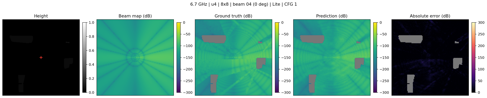

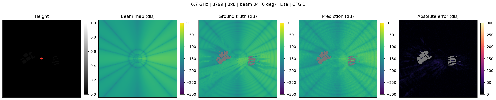
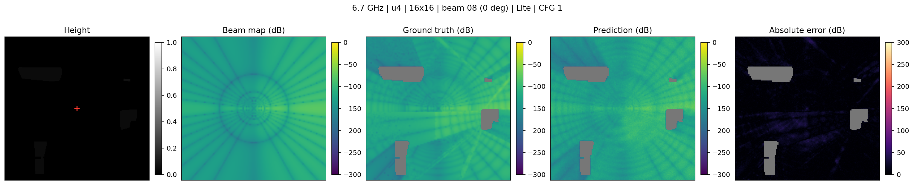
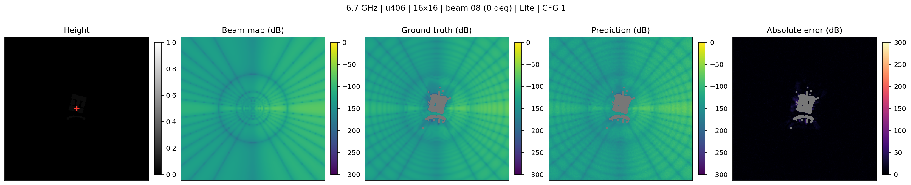
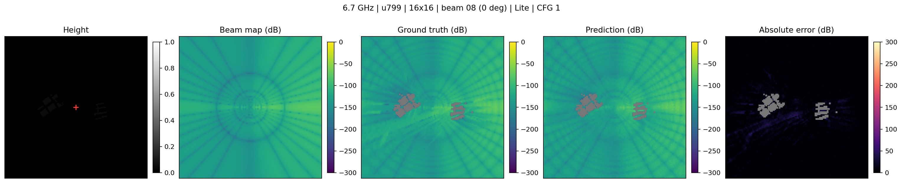
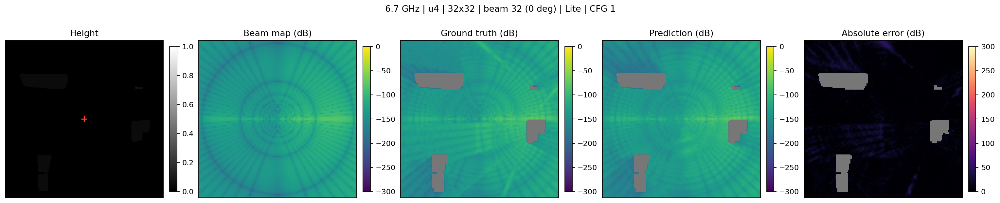
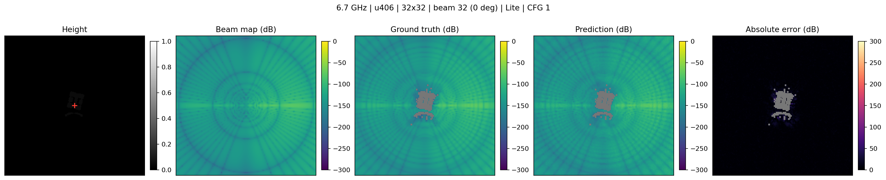
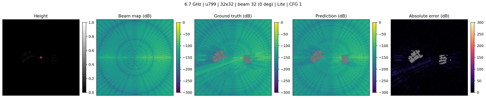

误差图（dB 绝对误差）：

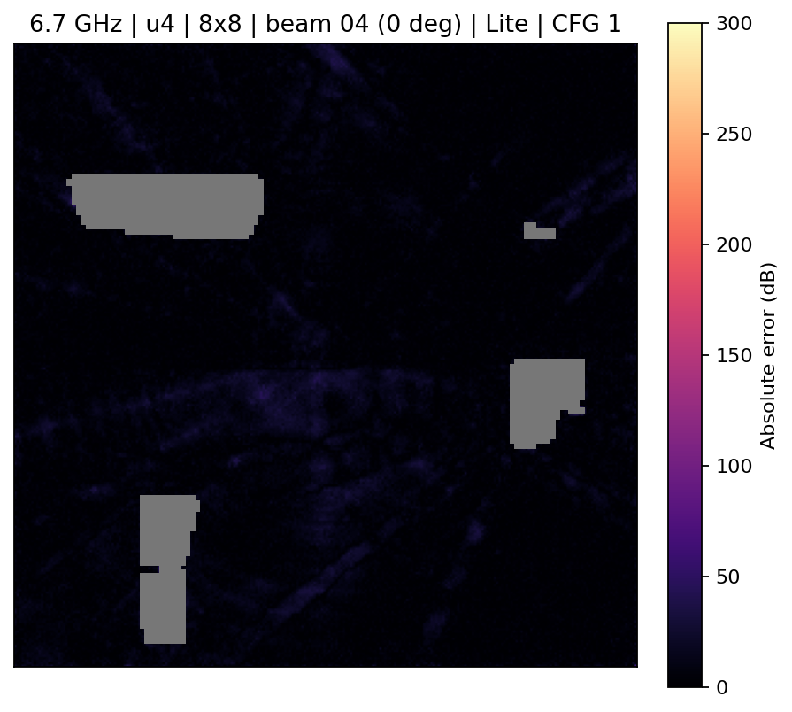
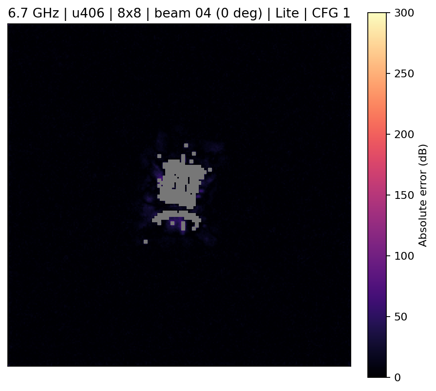
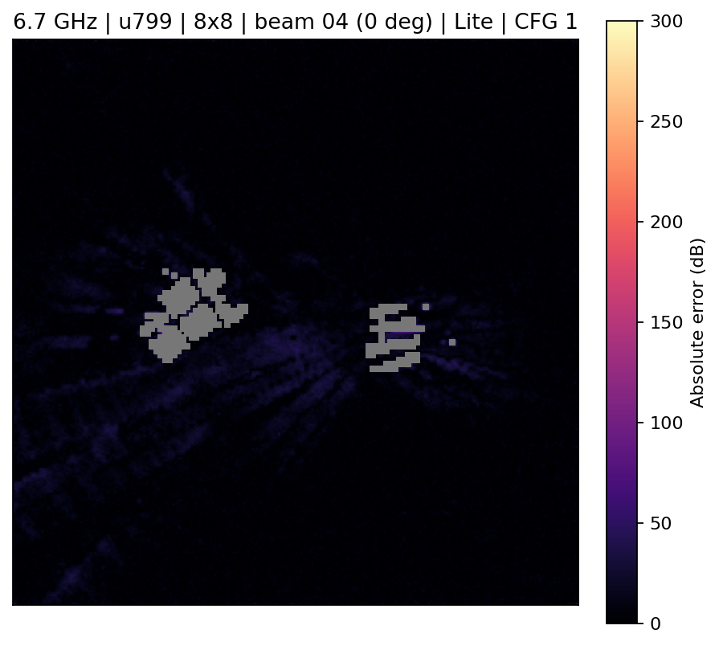
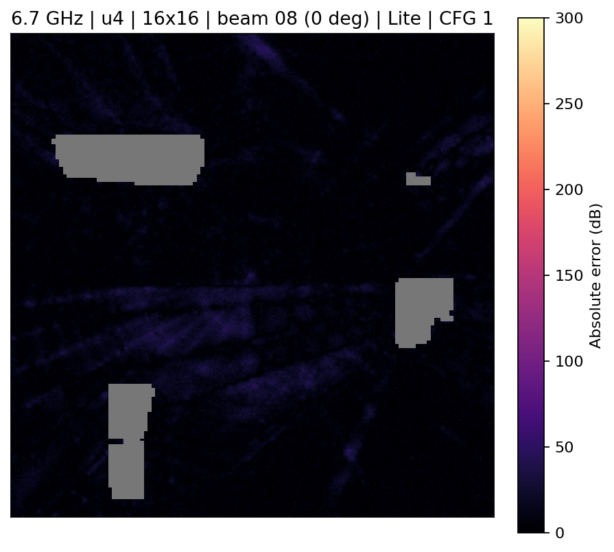
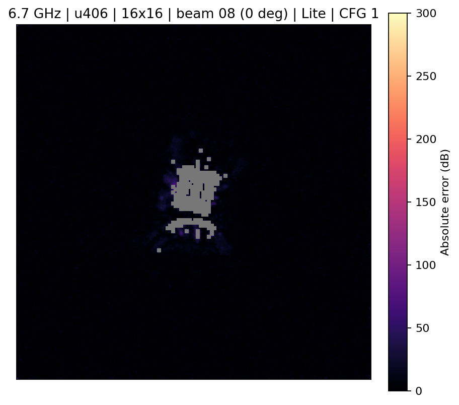
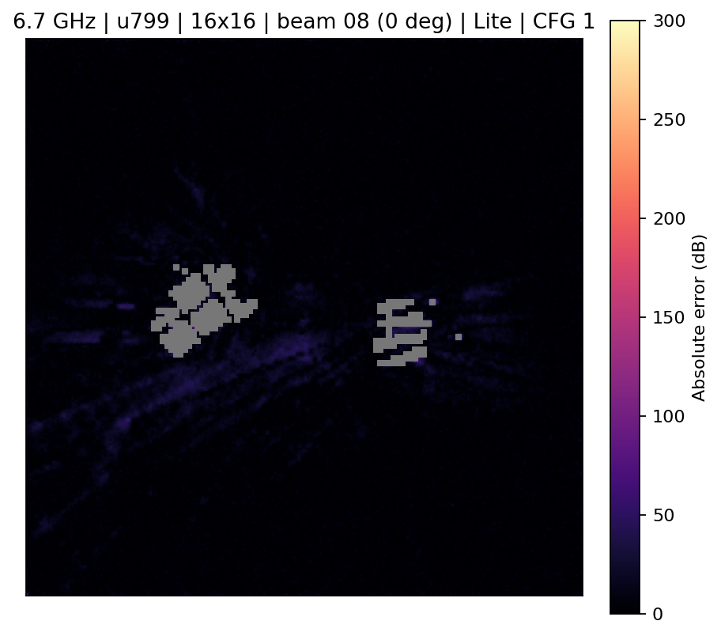

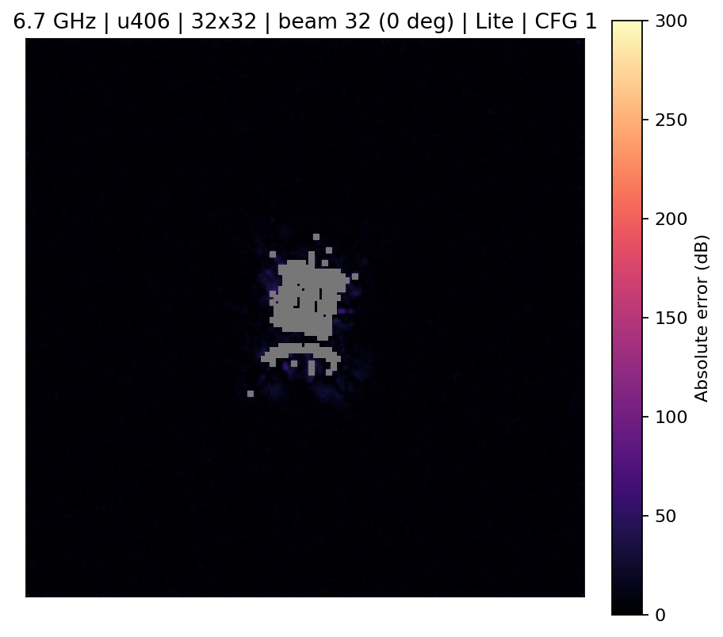
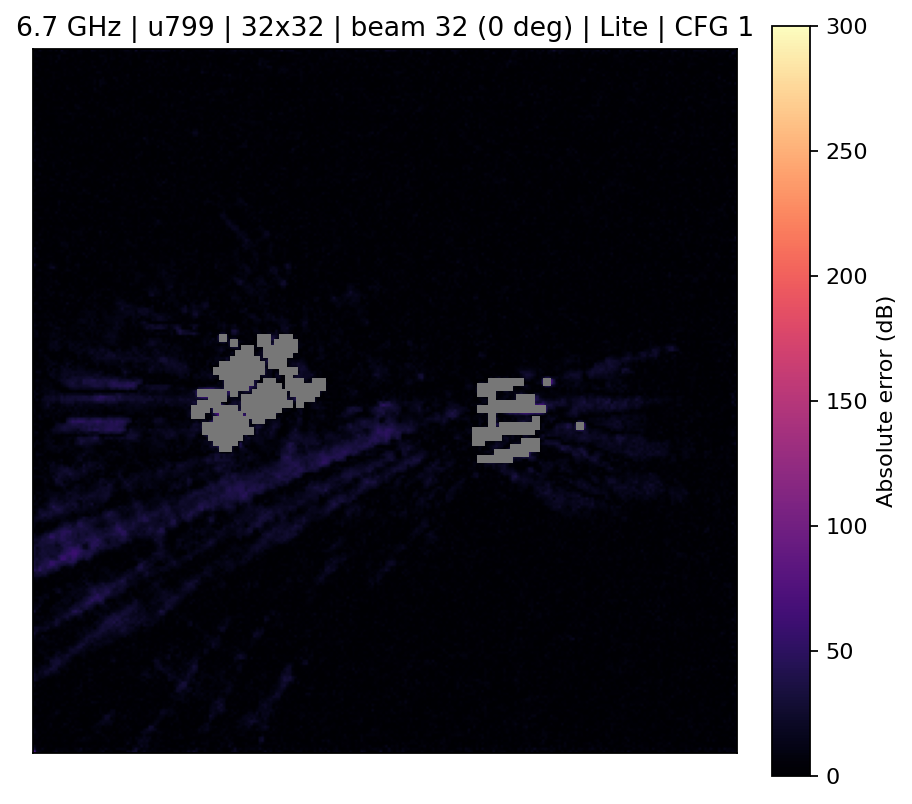

## 2. 8×8 跨频率 Lite（4.9 训练/验证 → 6.7 测试）

协议：训练与验证在 4.9 GHz（0°，560/80 场景），测试在 6.7 GHz（0°，160 场景），
场景划分与单波束控制完全一致（split_sha256 `a62ffd48…`）。注意：同是 0° 转向，
4.9 GHz 用 beam_id=0、6.7 GHz 用 beam_id=4，两者 beam map 来自不同阵列配置，属于
跨频率时波束索引未对齐的已知口径问题。

### 2.1 训练过程

- 完成 602 轮 / 6020 优化步，训练时长 14.1 h，无提前停止（最终 602 轮）。
- 验证集（4.9 GHz）最佳在第 582 轮：dB-RMSE 9.915、dB-MAE 6.327、PSNR 29.617、SSIM 0.870。
- 训练曲线关键节点（val 4.9 GHz）：epoch 100 → 85.17 dB；200 → 24.85 dB；
  300 → 13.39 dB；400 → 10.60 dB；500 → 10.00 dB；582 → 9.91 dB（最佳）。
- CFG 扫描（val 4.9 GHz）：1.0 → 9.915 dB（选用），1.5 → 10.806，2.0 → 12.030，2.5 → 13.530。

### 2.2 测试集指标（160 场景，6.7 GHz，0°）

| 指标 | 数值 |
|---|---|
| dB-RMSE | 13.280 |
| dB-MAE | 9.570 |
| NMSE | 0.005523 |
| PSNR | 27.078 |
| SSIM（11×11 窗口） | 0.795 |
| 选用 checkpoint | epoch 582，CFG 1.0，EMA |

跨频率测试（13.28 dB）比同频率单波束测试（11.63 dB）差 1.65 dB，反映 4.9→6.7 GHz
的域偏移；验证集（4.9 GHz，9.91 dB）与测试集（6.7 GHz，13.28 dB）之间有 3.37 dB 的
泛化落差。

### 2.3 推理延迟（A2000 Laptop，2 步 Euler，EMA）

均值 85.2 ms / 样本，p50 83.0 ms，p95 100.3 ms；峰值显存 111.4 MB；
模型参数 3,994,859。

### 2.4 可视化（6.7 GHz 测试场景 u4 / u406 / u799）

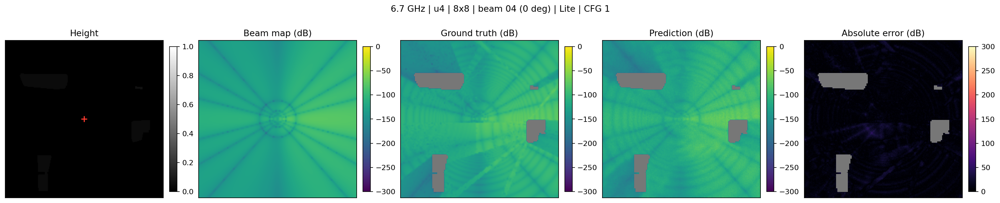
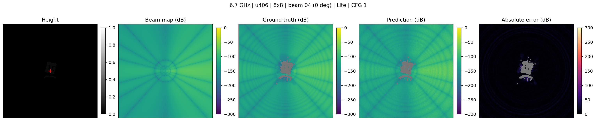
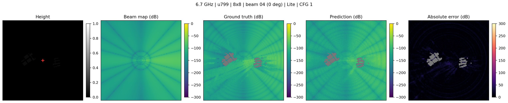

误差图：

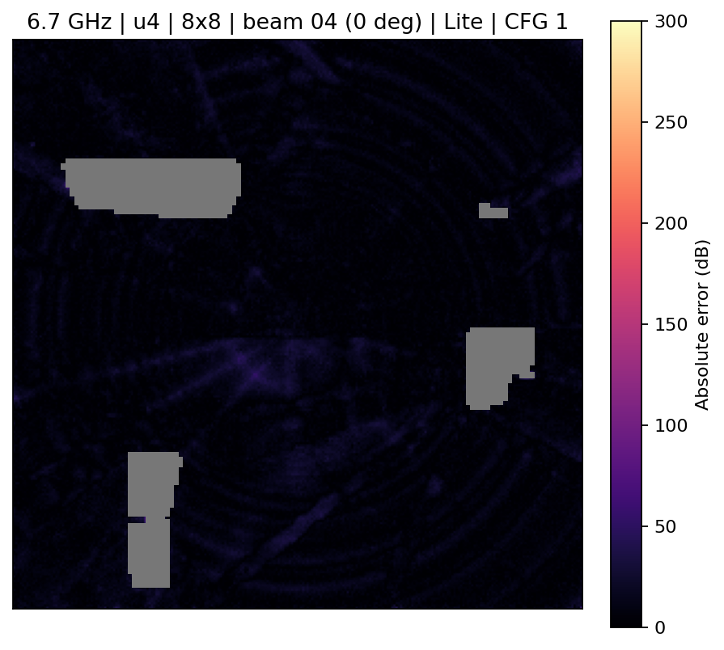
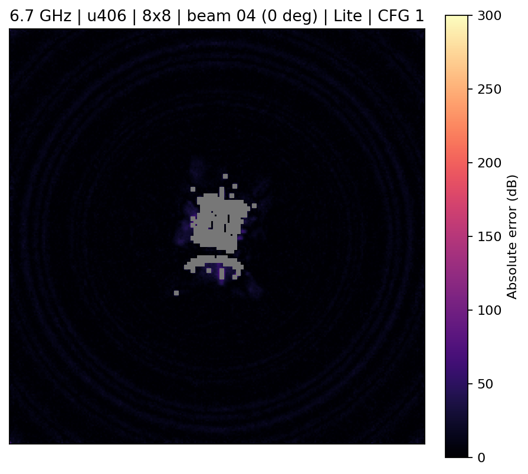
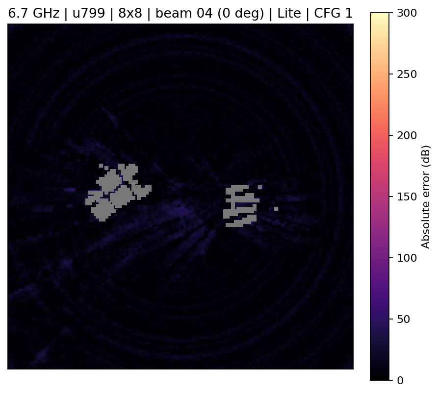

## 3. 结论与注意事项

- 三个单波束 Lite 阵列指标非常接近（test 11.63/11.66/11.70 dB），阵列规模对
  0° 单波束预测影响很小。
- 跨频率比同频率整体差约 1.65 dB（test），且验证→测试落差 3.37 dB，是频率域偏移的直接体现。
- 所有 SSIM 均为 11×11 高斯窗标准 SSIM；CFG 扫描一致表明 CFG=1.0 最优。
- 训练曲线显示 300 轮后进入慢收敛区，400 轮后基本平台（约 10 dB val）。
